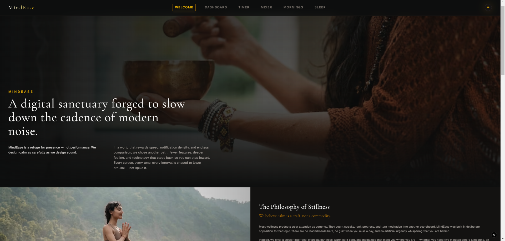
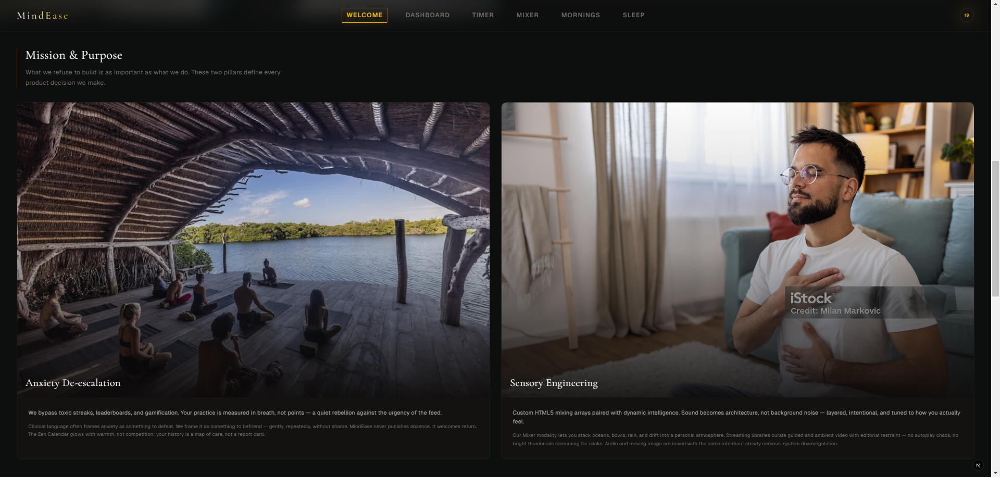
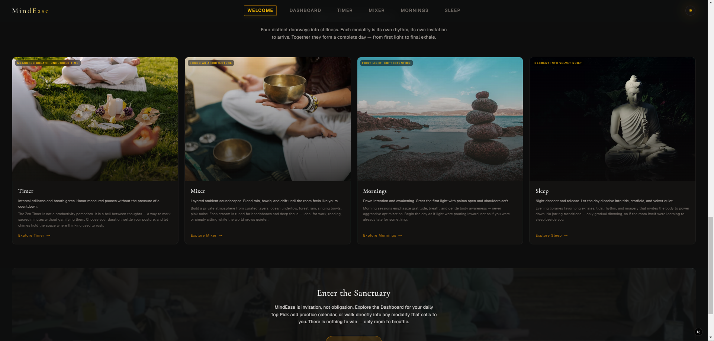
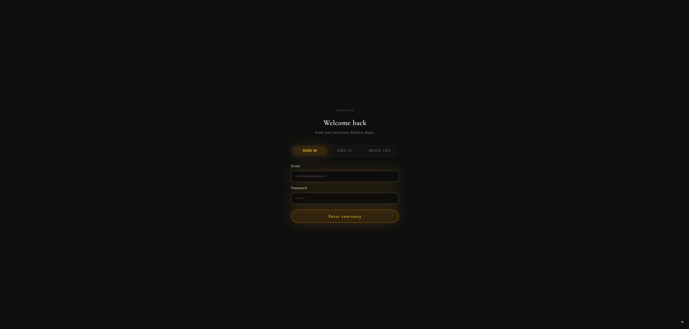
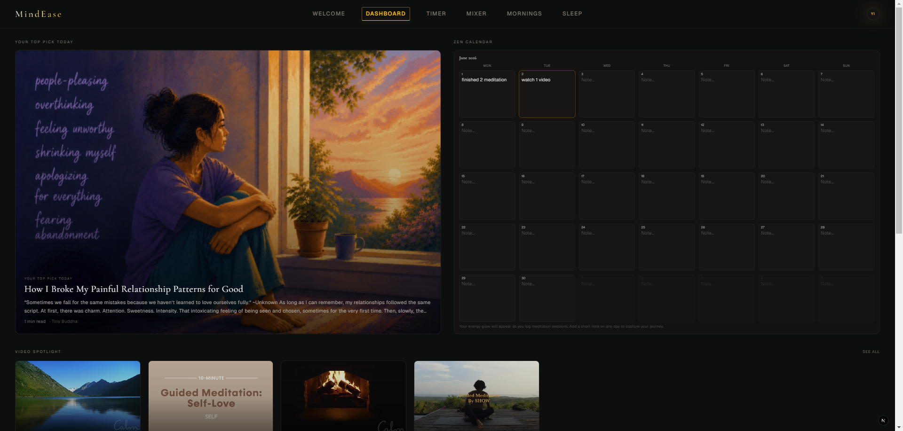
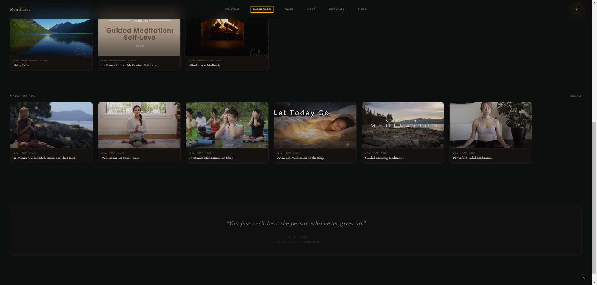
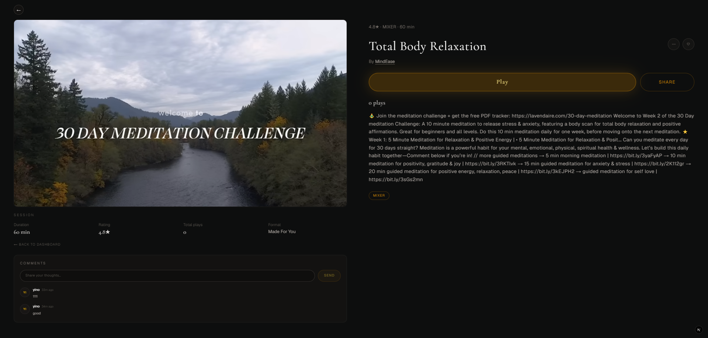
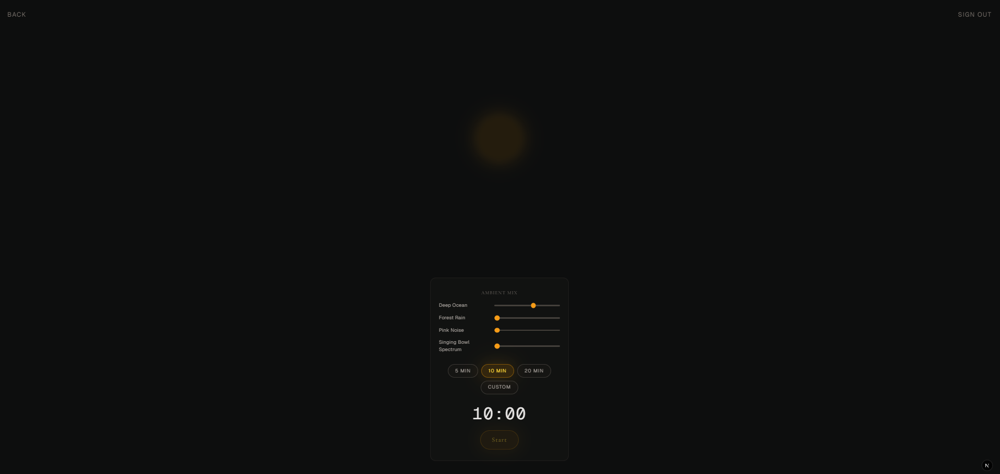
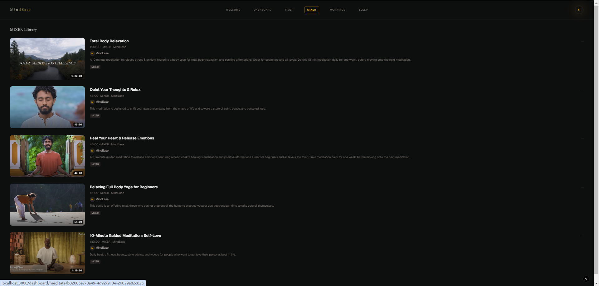
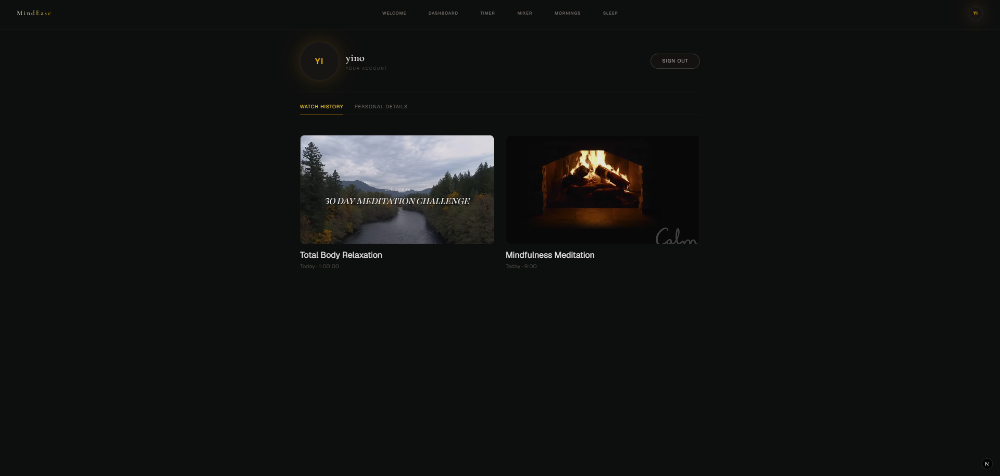

# MindEase

A meditation web app with a dark, minimal “sanctuary” aesthetic. Guests land on a welcome About page; signed-in users get a dashboard, modality libraries, a Zen timer with layered ambient sound, structured courses, and session logging with optional journaling.

## Screenshots

<p align="center">
  
</p>

<p align="center">
  
</p>

<p align="center">
  
</p>

### Sign in & Sign up Page
<p align="center">
  
</p>

### Dashboard
<p align="center">
  
</p>

<p align="center">
  
</p>

### Video Detailed Page
<p align="center">
  
</p>

### Timer Page
<p align="center">
  
</p>

### Mixer Page
<p align="center">
  
</p>

### Profile Page
<p align="center">
  
</p>

<p align="center">
  
</p>
Built with **Next.js 16** (App Router), **React 19**, **Tailwind CSS 4**, **Prisma**, and **Supabase** (Auth + PostgreSQL).

## Features

| Area | Description |
|------|-------------|
| **Welcome (`/`)** | Full About experience; guests see **Sign in to explore more** → `/login?next=/dashboard` |
| **Dashboard** | Top Pick (Daily Pick article), Video Spotlight, Made For You, Zen Calendar (practice history + per-day notes), Quote of the Day |
| **Daily Pick (`/daily-pick`)** | Daily featured article sourced from RSS, rendered in-app with hero image + extracted main content, plus reference link to original |
| **Zen Timer** | Preset/custom duration, layered ambient mixer (Web Audio API), pause/continue, progress bar, session log + journal modal |
| **MIXER / MORNINGS / SLEEP** | Category video libraries (YouTube playback) with cover art and intros |
| **Courses** | 3-day foundation course with day gating and progress |
| **Daily Zen** | Weekday-themed guided practice |
| **Video detail** | Leave comments under sessions (name + avatar + comment body) |
| **Profile** | Profile settings (display name/username/avatar, password) + Watch History grid |
| **Auth** | Email/password sign-in, sign-up, magic link via Supabase |

## Tech stack

- **Framework:** Next.js 16, TypeScript
- **UI:** Tailwind CSS 4, Framer Motion
- **Database:** PostgreSQL (Supabase) via Prisma
- **Auth:** Supabase Auth (`@supabase/ssr`)
- **Media:** YouTube (`react-player`), Supabase Storage for ambient MP3s and optional assets

## Project structure

```
src/
  app/                    # Routes (pages + API)
    api/                  # REST: meditate, streaming, courses, ambient-tracks, logs, journal
    auth/                 # callback, signout
    dashboard/            # Home + meditate/play detail
    daily-pick/           # Daily featured article (extracted from RSS source pages)
    zen-timer/            # Timer tool
    mixer|mornings|sleep/ # Category libraries
    courses|daily|profile/
    login/
    page.tsx              # Welcome / About (root)
  components/             # UI by domain (dashboard, timer, about, courses, streaming, auth)
  hooks/                  # useZenTimer, useAudioMixer, useChime
  lib/                    # Prisma, Supabase, queries, content
    comments/             # Video detail comments
    daily-pick/           # RSS fetch + content extraction (Readability)
    watch-history/        # Watch history queries/types
    zen-calendar/         # Calendar aggregation + notes
prisma/
  schema.prisma           # Data model
  seed.ts                 # MVP seed data + library sync/cleanup
public/
  images/covers/          # Library thumbnails (e.g. mixer-1.png, m1.png, s1.png)
  cover/                  # Dashboard / streaming covers
```

## Routes

| Path | Access | Purpose |
|------|--------|---------|
| `/` | Public | Welcome / About |
| `/login` | Public | Sign in / sign up / magic link |
| `/dashboard` | Auth | Main hub |
| `/daily-pick` | Auth | Daily featured article (in-app reader + original link) |
| `/zen-timer` | Auth | Meditation timer |
| `/mixer`, `/mornings`, `/sleep` | Auth | Category libraries |
| `/dashboard/meditate/[id]` | Auth | Library session detail + play |
| `/dashboard/play/[id]` | Auth | Streaming item player |
| `/courses`, `/courses/.../day/[n]` | Auth | Foundation course |
| `/daily` | Auth | Daily Zen |
| `/profile` | Auth | Profile |
| `/about` | Public | Redirects to `/` |

`/timer` redirects to `/zen-timer`.

## Prerequisites

- Node.js 20+
- Supabase project (Auth + PostgreSQL)
- Optional: Supabase Storage bucket `meditation-assets` for ambient timer audio

## Environment variables

Create `.env` in the project root (do not commit):

```env
# Database (Supabase PostgreSQL)
DATABASE_URL="postgresql://..."
DIRECT_URL="postgresql://..."   # optional pooler URL for Prisma

# Supabase Auth
NEXT_PUBLIC_SUPABASE_URL=https://<project-ref>.supabase.co
NEXT_PUBLIC_SUPABASE_ANON_KEY=<anon-key>

# App URL (magic links / callbacks)
NEXT_PUBLIC_SITE_URL=http://localhost:3000

# Optional overrides
NEXT_PUBLIC_CHIME_AUDIO_URL=
CHIME_AUDIO_URL=
```

See [`src/app/docs/auth-setup.md`](src/app/docs/auth-setup.md) for Supabase dashboard settings (redirect URLs, email provider).

## Getting started

```bash
# Install dependencies
npm install

# Push schema and generate client
npm run db:push
npm run db:generate

# Seed demo content (ambient tracks, course, libraries, streaming catalog)
npm run db:seed

# Run dev server
npm run dev
```

Open [http://localhost:3000](http://localhost:3000).

## Scripts

| Command | Description |
|---------|-------------|
| `npm run dev` | Start Next.js dev server |
| `npm run build` | Production build |
| `npm run start` | Start production server |
| `npm run lint` | ESLint |
| `npm run db:generate` | Generate Prisma client |
| `npm run db:push` | Sync schema to database |
| `npm run db:migrate` | Run migrations (dev) |
| `npm run db:seed` | Seed / update MVP data |
| `npm run db:studio` | Open Prisma Studio |

## Content & libraries

Category videos (**MIXER**, **MORNINGS**, **SLEEP**) are stored in `meditation_audios` and loaded via `GET /api/meditate?category=MIXER|MORNINGS|SLEEP`.

**To change library videos:**

1. Edit `CATEGORY_LIBRARY_SEED` in [`prisma/seed.ts`](prisma/seed.ts) (`name`, `url` for YouTube, `coverUrl`, `introduction`, `sortOrder`).
2. Add matching cover images under `public/images/covers/`.
3. Run `npm run db:seed`.

The seed script **upserts** items by `name` + `category` and **removes** library rows that are no longer in the seed or have missing cover files under `public/`.

Dashboard streaming (Spotlight / Made For You) and course/daily content are also defined in `prisma/seed.ts`.

## API overview

- `GET /api/meditate?category=` — category library cards
- `GET /api/streaming`, `GET /api/streaming/[id]` — streaming catalog
- `GET /api/watch-history`, `POST /api/watch-history` — profile watch history + play tracking
- `GET /api/media/[id]/comments`, `POST /api/media/[id]/comments` — video detail comments
- `PUT /api/zen-calendar/notes` — save per-day Zen Calendar note
- `POST /api/meditate/log` — log timer/course sessions
- `POST /api/meditate/journal` — attach journal to a log
- `GET /api/ambient-tracks` — Zen Timer soundscape layers
- `GET /api/courses`, `GET /api/daily-zen` — course and daily content

## Auth flow

- Middleware refreshes the Supabase session and protects app routes (see [`src/middleware.ts`](src/middleware.ts)).
- Sign-in redirects to `next` query param or `/dashboard`.
- Sign-out: `POST /auth/signout` → clears cookies and redirects to `/`.

## Design notes

- Dark theme base: `#0D0E0E`, amber accents (`.sacred-glow`).
- Serif headings, wide letter-spacing for a calm editorial feel.
- Timer enters an immersive mode (footer fades) while session HUD stays visible for time remaining and pause/continue/exit.

## Further reading

- [`src/app/docs/auth-setup.md`](src/app/docs/auth-setup.md) — Supabase Auth checklist
- [`src/app/docs/PRD.md`](src/app/docs/PRD.md) — product notes
- [`AGENTS.md`](AGENTS.md) — Next.js agent rules for this repo

## License

Private project (`"private": true` in `package.json`).
